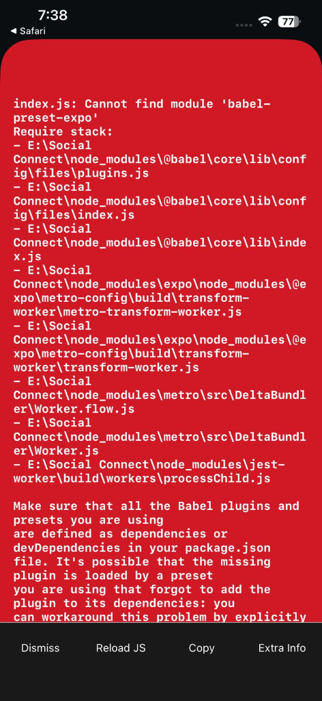
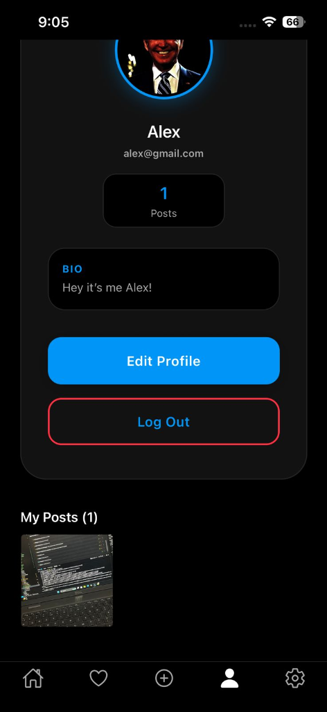

# Social Connect

Social Connect is a high-end, premium mobile social networking application built with React Native and Expo. The design is inspired by modern dark mode aesthetics, featuring a pitch-black interface, clean layouts, and vector icons.

## Features

- **Personalized Feed**: Scroll through user posts featuring high-resolution images, rich captions, relative timestamps, and interaction counts.
- **Interactive Post Options**: Toggle post likes and view comment sections instantly.
- **User Comments**: Participate in real-time discussions with multiline text inputs and user profile routing.
- **Activity & Notifications**: Stay updated with custom push-like activity notifications for likes, comments, and new followers.
- **Instagram-Inspired Profiles**: Access a clean profile grid layout featuring user posts, followers, following metrics, name, and bio descriptions.
- **Settings Screen**: Control account privacy, support requests, help centers, and secure logouts.
- **Authentication**: Seamlessly log in, register, or request password resets via a persistent Mock Auth service (making it fully functional for demo/local testing).

## App Screenshots

### Home Feed & Profile Screen
| Feed View | Profile View |
|:---:|:---:|
|  |  |

## Tech Stack

- **Framework**: React Native (Expo SDK 54)
- **Navigation**: React Navigation (Stack and Tab Navigators)
- **Icons**: Expo Vector Icons (Ionicons)
- **Animation**: React Native Reanimated (Fade-ins and transitions)
- **State Management**: React Context API
- **Data Persistence**: React Native AsyncStorage

## Getting Started

### Prerequisites

Ensure you have the following installed:
- Node.js (version 18 or above recommended)
- npm or yarn
- Expo Go app installed on your physical device (iOS or Android)

### Installation

1. Clone the repository:
   ```bash
   git clone https://github.com/tech-raffay/Social-Connect-Application.git
   cd Social-Connect-Application
   ```

2. Install dependencies:
   ```bash
   npm install
   ```

### Running the App

Start the development server with cleared cache:
```bash
npx expo start -c
```

Scan the QR code displayed in the terminal using:
- The Camera app on iOS (redirects to Expo Go)
- The Expo Go app on Android

## Project Structure

```text
├── assets/             # App icons, splash screens, and local assets
├── screenshots/        # App screenshots for documentation
├── src/
│   ├── components/     # Custom UI buttons, inputs, and loader overlays
│   ├── constants/      # App color palettes and design theme tokens
│   ├── context/        # AppContext managing auth, notifications, and posts state
│   ├── firebase/       # Firebase initialization and fallback config
│   ├── navigation/     # App stacks and tab routing configurations
│   ├── screens/        # Screen views (Auth, Feed, Comments, Profile, Notifications)
│   ├── services/       # Database, Authentication, and Storage interface controllers
│   └── utils/          # Formatting helpers and validation routines
├── App.tsx             # Main entry component
├── app.json            # Expo configuration parameters
└── package.json        # Dependencies list and scripts
```
